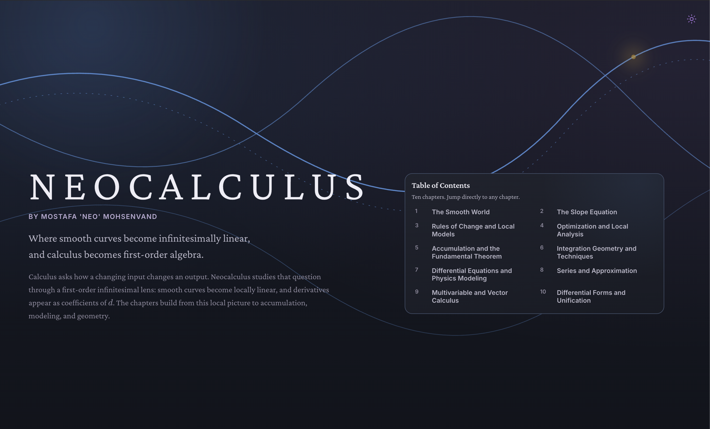

<p align="center">
  
</p>

<h1 align="center">Neocalculus</h1>

<p align="center">
  <strong>Where smooth curves become infinitesimally linear, and calculus becomes first-order algebra.</strong>
</p>

<p align="center">
  <a href="https://neovand.github.io/neocalculus/"><strong>Read the book →</strong></a>
</p>

<p align="center">
  
  
  
  
  
  
  
</p>

Neocalculus is an open, interactive calculus book built around one visual idea: at a sufficiently small scale, a smooth curve becomes a line. From that local picture, derivatives become coefficients, integrals become accumulation, and the familiar theorems of calculus grow into a single geometric language.

This is not a conventional textbook transferred onto a screen. It is a book designed for the screen—dark-first, responsive, and filled with figures that invite the reader to move a point, turn a surface, change a parameter, and watch the mathematics respond.

## Why Neocalculus?

- **Intuition before machinery.** New ideas begin with a picture, a motion, or a local question before notation is introduced.
- **An infinitesimal-first narrative.** Smoothness and first-order change provide the connective tissue from single-variable calculus to differential forms.
- **Interactive figures with a purpose.** Sliders, movable points, vector fields, surfaces, and numerical experiments turn passive diagrams into mathematical objects you can interrogate.
- **One visual language.** Curves, tangents, points, solutions, and errors keep consistent semantic colors throughout the book.
- **A continuous path.** Eleven chapters build from functions and local linearity to gradients, complex analysis, and Stokes-style unification.

## The journey

|     | Chapter                                         | Central idea                                                              |
| --: | ----------------------------------------------- | ------------------------------------------------------------------------- |
|   1 | **The Smooth World**                            | Functions, infinitesimals, and why smooth curves look straight up close   |
|   2 | **The Slope Equation**                          | Derivatives as the coefficient of first-order change                      |
|   3 | **Rules of Change and Local Models**            | Product, chain, quotient, implicit differentiation, and linearization     |
|   4 | **Optimization and Local Analysis**             | Critical points, extrema, curve behavior, and Newton's method             |
|   5 | **Accumulation and the Fundamental Theorem**    | Signed accumulation, moving endpoints, and antiderivatives                |
|   6 | **Integration Geometry and Techniques**         | Substitution, integration by parts, slices, work, and averages            |
|   7 | **Differential Equations and Physics Modeling** | Local laws, initial conditions, growth, cooling, and motion               |
|   8 | **Series and Approximation**                    | Taylor polynomials, error, convergence, and infinite representation       |
|   9 | **Multivariable and Vector Calculus**           | Partials, gradients, Jacobians, vector fields, and 3D geometry            |
|  10 | **Differential Forms and Unification**          | Exterior differentiation and the common structure behind Stokes' theorems |

## Built as a living textbook

The page is intentionally a single, connected reading experience. Chapters load progressively, navigation remains close at hand, mathematical typesetting is rendered with KaTeX, and interactive geometry is drawn with a mix of native SVG, Canvas, WebGL, and JSXGraph. The result is fast enough to feel immediate while remaining inspectable, portable, and deployable as a static site.

The design supports light and dark themes, respects reduced-motion preferences, and scales from a phone to a wide desktop without turning the figures into afterthoughts.

## Run it locally

You will need a current Node.js release; the deployment workflow uses Node 22.

```bash
git clone https://github.com/NeoVand/neocalculus.git
cd neocalculus
npm ci
npm run dev
```

Then open the local URL printed by Vite.

Useful commands:

```bash
npm run check    # Svelte and TypeScript diagnostics
npm run lint     # Prettier and ESLint
npm run build    # Production static build
npm run preview  # Preview the production build
```

## Deployment

Every push to `main` is built as a static SvelteKit site and deployed by GitHub Actions to [GitHub Pages](https://neovand.github.io/neocalculus/). The workflow supplies the repository base path, so routes and assets resolve correctly under `/neocalculus/`.

## Project map

```text
src/lib/chapters/     the ten chapter manuscripts
src/lib/components/   interactive figures and shared book UI
src/lib/utils/        rendering, theme, and interaction helpers
src/routes/           the book shell, global design system, and metadata
static/               public assets used by the production site
```

## Author

Created by **Mostafa “Neo” Mohsenvand** as an experiment in making calculus feel coherent, visual, and genuinely inviting again.

> Calculus, reimagined from first principles.
